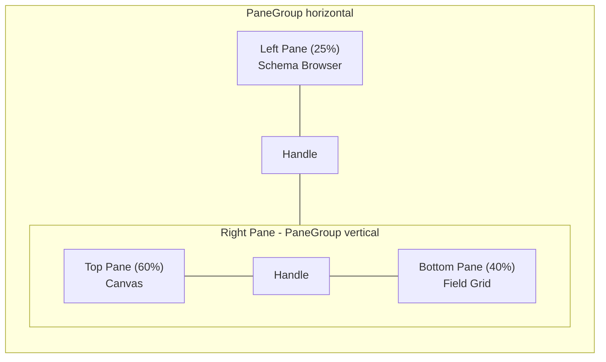

# Dataset Builder Module

## Overview

A visual query designer that lets users define "datasets" by dragging database tables onto a canvas, defining joins between them, and selecting output fields with optional WHERE clauses. The module follows the same architectural patterns as the existing workflow builder but adapts the UX to a query-design paradigm.

---

## Architecture

### Data Model (New Supabase Tables)

Three new tables in the `deebee_edms` schema:

- **`db_connections`** -- Stores external database connection configurations
  - `id`, `organization_id`, `name`, `description`, `engine` (postgres, mysql, mssql, sqlite), `connection_config` (Json -- host, port, database, schema, ssl, etc.), `is_active`, timestamps
  - Connection secrets (passwords) stored separately or encrypted -- details TBD based on security posture

- **`db_connection_schemas`** -- Cached introspection of a connection's tables, views, columns, and foreign keys
  - `id`, `db_connection_id`, `schema_data` (Json -- array of tables with columns and FK info), `introspected_at`
  - Refreshed on-demand via an "introspect" action

- **`datasets`** -- Stores the visual query definition (analogous to `workflows.definition`)
  - `id`, `organization_id`, `db_connection_id`, `name`, `description`, `definition` (Json -- `DatasetDefinition`), `version`, `is_active`, timestamps

### Core TypeScript Types (`src/lib/datasets/types.ts`)

```typescript
interface DatasetDefinition {
  id: string;
  name: string;
  description?: string;
  version: number;
  tables: DatasetTable[]; // tables/views placed on canvas
  joins: DatasetJoin[]; // connections between tables
  fields: DatasetField[]; // selected output columns
  filters: DatasetFilter[]; // WHERE clause conditions
  sort: DatasetSort[]; // ORDER BY
  viewport?: { x: number; y: number; zoom: number };
}

interface DatasetTable {
  id: string; // node ID on canvas
  schema: string;
  tableName: string;
  alias: string;
  position: { x: number; y: number };
}

interface DatasetJoin {
  id: string; // edge ID
  sourceTableId: string;
  sourceColumn: string;
  targetTableId: string;
  targetColumn: string;
  joinType: "inner" | "left" | "right" | "full";
}

interface DatasetField {
  id: string;
  tableId: string;
  columnName: string;
  alias?: string;
  visible: boolean; // include in SELECT
  aggregation?: "count" | "sum" | "avg" | "min" | "max";
  sortDirection?: "asc" | "desc";
  sortOrder?: number;
}

interface DatasetFilter {
  id: string;
  tableId: string;
  columnName: string;
  operator: string; // reuse FilterOperator from data-table
  value: string;
  logic: "and" | "or";
}
```

### SQL Generation (`src/lib/datasets/sql-generator.ts`)

- Takes a `DatasetDefinition` + connection dialect and produces a parameterized SQL string
- Leverages the existing `@deebeetech/sqleasy` library (already in the project) for dialect-aware SQL building
- Generates SELECT, FROM with JOINs, WHERE, GROUP BY (when aggregations present), ORDER BY

---

## Route Structure

```
src/routes/(app-layout)/app/
  connections/
    +page.svelte              -- List connections (AppDataTable)
    +page.server.ts           -- CRUD actions
    [id]/
      +page.svelte            -- Connection detail / introspect
      +page.server.ts
  datasets/
    +page.svelte              -- List datasets (AppDataTable)
    +page.server.ts           -- CRUD actions
    [id]/
      +page.svelte            -- Dataset Builder (full-screen editor)
      +page.server.ts         -- load + save actions
```

Update [app-sidebar.svelte](src/lib/components/app-sidebar.svelte) to add navigation items for Connections, Datasets, and Workflows.

---

## Dataset Builder UI Layout

The editor page at `/app/datasets/[id]` uses paneforge (already available as `src/lib/components/ui/resizable/`) for a fully resizable layout:

```
+--------------------------------------------------------------+
| Header: Back | Dataset Name | Unsaved indicator | Save       |
+--------------------------------------------------------------+
|              |                                                |
| Table List   |  Canvas (drag tables, draw joins)              |
| (schema      |  @xyflow/svelte with custom TableNode          |
|  browser)    |  that shows table name + column list           |
|              |                                                |
| 1/4 width    |-----------------------------------------------|
|              |  Field Grid (selected columns, aliases,        |
| - Search     |  sort, criteria/WHERE, show/hide)              |
| - Tables     |  Similar to Access QBE grid                   |
| - Views      |                                                |
+--------------------------------------------------------------+
```



### Left Panel: Schema Browser (`schema-browser.svelte`)

- Loads cached `db_connection_schemas.schema_data` for the dataset's connection
- Tree view of schemas > tables/views > columns (reuse existing `tree-view` UI component)
- Search/filter input at top
- Each table/view is **draggable** (HTML5 drag with `application/dataset-table` MIME type, same pattern as workflow `node-palette.svelte`)
- Columns show data type badges (varchar, int, timestamp, etc.)
- Foreign key indicators on columns

### Top Panel: Table Canvas (`dataset-canvas.svelte`)

- Built on `@xyflow/svelte` (same library as workflow builder)
- **Custom node type: `TableNode`** -- renders as a card showing:
  - Table name header (with alias)
  - Scrollable column list with type indicators and FK icons
  - Each column row is a connection handle (source + target) for drawing joins
- **Custom edge type: `JoinEdge`** -- shows join type label (INNER, LEFT, etc.), click to change join type via popover
- **Drop handler**: receives dragged table from schema browser, calls `screenToFlowPosition`, adds to `DatasetDefinition.tables`
- **Connection handler**: when user draws edge between column handles, creates a `DatasetJoin`
- Auto-detect and suggest joins from foreign key metadata
- Background, Controls, MiniMap (same as workflow canvas)

### Bottom Panel: Field Grid (`field-grid.svelte`)

- A table/grid (using the existing `Table` UI component) with columns:
  - **Field**: column name (dropdown or drag target from table nodes)
  - **Table**: which table the field belongs to
  - **Alias**: optional output alias
  - **Show**: checkbox (include in SELECT)
  - **Sort**: dropdown (none / asc / desc) + sort order
  - **Aggregation**: dropdown (none / count / sum / avg / min / max)
  - **Criteria**: inline filter expression (operator + value)
  - **Or**: additional OR criteria columns (Access-style)
- Rows are added by:
  - Double-clicking a column in a TableNode on the canvas
  - Dragging a column from the schema browser
  - Dragging a column from a TableNode
  - Manually adding via "Add Field" button
- Rows are reorderable (drag to reorder output column order)

---

## Component Structure

```
src/lib/components/dataset-builder/
  index.ts                       -- barrel export
  dataset-builder.svelte         -- orchestrator: state, pane layout, definition sync
  schema-browser.svelte          -- left panel
  dataset-canvas.svelte          -- top-right panel (@xyflow/svelte)
  field-grid.svelte              -- bottom-right panel
  custom-nodes/
    table-node.svelte            -- @xyflow custom node
  custom-edges/
    join-edge.svelte             -- @xyflow custom edge with join-type label
  sql-preview-dialog.svelte      -- modal showing generated SQL + preview results
```

---

## Key Interactions

1. **Drag table from browser to canvas** -- Adds a `DatasetTable` node, auto-checks FKs to existing tables and suggests joins
2. **Draw edge between columns** -- Creates a `DatasetJoin`, defaults to INNER JOIN
3. **Double-click column on canvas node** -- Adds a `DatasetField` row to the field grid
4. **Edit field grid row** -- Updates WHERE clauses, sort order, aggregation, aliases
5. **Remove table from canvas** -- Cascades: removes related joins and fields
6. **Preview SQL** -- Opens dialog with generated SQL and optional "Run" to see sample results
7. **Save** -- Serializes `DatasetDefinition` to JSON, POSTs to server action (same pattern as workflow save)

---

## SQL Preview and Execution

- **`sql-preview-dialog.svelte`** -- Shows the generated SQL with syntax highlighting (project already has `shiki`)
- **Server endpoint** `POST /api/datasets/[id]/preview` -- Generates SQL from definition, executes against the configured connection with a LIMIT, returns column metadata + rows
- Uses the connection's credentials server-side only (never exposed to client)

---

## Show and Tell Page

A standalone demo page at `/test-dataset-builder` (under `(no-layout)/`, same pattern as the existing `test-workflow`, `test-builder`, `test-form`, and `test-data-table` pages). This page requires no database, no auth, and no live connections -- everything runs off hardcoded sample data so you can walk someone through the feature in a meeting or screen share.

### Route

```
src/routes/(no-layout)/test-dataset-builder/
  +page.svelte                   -- demo shell with tabs
  sample-schema.ts               -- hardcoded schema metadata (e.g. a small HR database: employees, departments, salaries, titles)
  sample-dataset-definition.ts   -- pre-built DatasetDefinition with tables, joins, fields, and filters already wired up
```

### Page Structure (Tabs)

Following the `test-workflow` pattern, the page has three tabs:

1. **Builder** -- Full `DatasetBuilder` component rendered at near-full viewport height, pre-loaded with the sample definition and sample schema. User can drag tables, draw joins, add fields, and edit filters live.
2. **SQL** -- Shows the generated SQL from the current definition state in real time, syntax-highlighted with shiki. Includes a `CopyButton`. Demonstrates the SQL generator without needing a real connection.
3. **JSON** -- Raw JSON of the current `DatasetDefinition` (same as the workflow test page's JSON tab). Also includes a `CopyButton`.

### Sample Data (`sample-schema.ts`)

A realistic but small schema (no live DB needed) representing something like an HR database:

- **employees** (id, first_name, last_name, email, department_id, hire_date, salary)
- **departments** (id, name, location, manager_id)
- **titles** (id, employee_id, title, from_date, to_date)
- **salaries** (id, employee_id, amount, from_date, to_date)

Includes foreign key definitions (e.g. `employees.department_id -> departments.id`, `titles.employee_id -> employees.id`) so the auto-join suggestion feature can be demonstrated.

### Sample Definition (`sample-dataset-definition.ts`)

A pre-configured `DatasetDefinition` that:

- Has `employees` and `departments` already on the canvas with positions
- Has an INNER JOIN on `employees.department_id = departments.id`
- Has several fields selected (first_name, last_name, department name, salary)
- Has a sample filter (salary > 50000)
- Demonstrates sort (last_name ASC)

This gives the presenter a working starting point they can modify live during the demo.

---

## Implementation Phases

### Phase 1: Foundation

- Database migrations for `db_connections`, `db_connection_schemas`, `datasets`
- TypeScript types for `DatasetDefinition` and related interfaces
- SQL generator using SQLEasy
- Connection CRUD routes

### Phase 2: Schema Introspection

- Server-side introspection endpoint per database engine (start with Postgres using the existing `postgres` package)
- Cache introspected schema in `db_connection_schemas`
- Schema browser component with tree view

### Phase 3: Visual Query Builder

- Dataset list page and editor route
- `DatasetBuilder` component with paneforge layout
- `DatasetCanvas` with custom `TableNode` and `JoinEdge`
- `FieldGrid` component
- Wire drag-and-drop between all three panels
- **Show and tell page** (`/test-dataset-builder`) with sample schema and pre-built definition -- available as soon as the builder component works, no DB required

### Phase 4: SQL Generation and Preview

- SQL generator from `DatasetDefinition`
- Preview dialog with syntax highlighting
- Server-side query execution against the connection
- Result display in a data table

### Phase 5: Polish

- Sidebar navigation updates
- Auto-join suggestions from FK metadata
- Undo/redo support
- Dataset versioning
- Integration points for the future forms module
