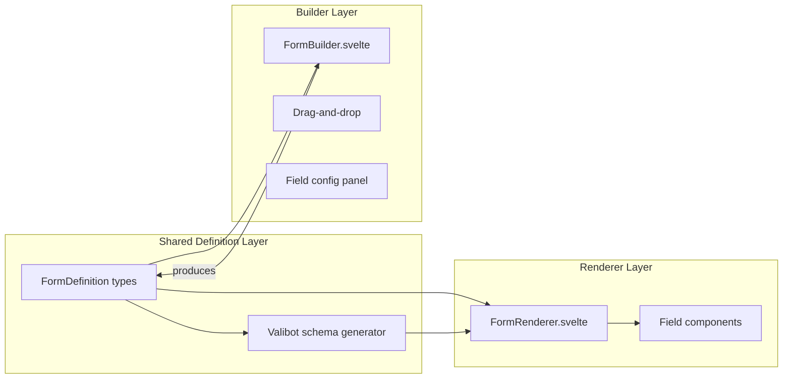

# Dynamic Form Builder and Renderer

## Architecture Overview

Three layers, each cleanly separated:



The `FormDefinition` is a plain JSON-serializable object -- it can be stored in a Supabase JSONB column, a `.json` file, or passed as a prop. It is the single source of truth that both the builder produces and the renderer consumes.

---

## 1. Dependencies to Install

- `valibot` -- validation library (user preference over Zod)
- `svelte-dnd-action` -- drag-and-drop for the builder (works with Svelte 5, uses `use:dndzone` action)

The project already has `sveltekit-superforms` (v2.30.1) and `formsnap` (v2.0.1) installed.

---

## 2. Shared Definition Layer

### File: [src/lib/forms/types.ts](src/lib/forms/types.ts) (new)

Core types that define the shape of any dynamic form:

```typescript
export type FieldType =
  | "text"
  | "email"
  | "password"
  | "number"
  | "textarea"
  | "select"
  | "checkbox"
  | "switch"
  | "radio"
  | "date"
  | "phone"
  | "tags"
  | "file"
  | "slider"
  | "otp"
  | "color"
  | "richtext";

export interface FieldOption {
  label: string;
  value: string;
}

export interface FieldValidation {
  min?: number;
  max?: number;
  minLength?: number;
  maxLength?: number;
  pattern?: string;
  step?: number;
}

export interface FormFieldDefinition {
  id: string;
  name: string;
  type: FieldType;
  label: string;
  placeholder?: string;
  description?: string;
  required?: boolean;
  disabled?: boolean;
  defaultValue?: unknown;
  options?: FieldOption[]; // for select, radio
  validation?: FieldValidation;
  width?: "full" | "half"; // layout hint
}

export interface FormDefinition {
  id: string;
  name: string;
  description?: string;
  fields: FormFieldDefinition[];
}
```

### File: [src/lib/forms/schema.ts](src/lib/forms/schema.ts) (new)

Converts a `FormDefinition` into a Valibot object schema at runtime. Each `FieldType` maps to a Valibot base type (`v.string()`, `v.number()`, `v.boolean()`, etc.) with validation pipes applied from `FieldValidation`. Required/optional is handled via `v.optional()`.

Key mapping logic:

- `text/email/password/textarea/phone/color/richtext` -- `v.string()` + pipes (email, minLength, maxLength, regex)
- `number/slider` -- `v.number()` + pipes (minValue, maxValue)
- `checkbox/switch` -- `v.boolean()`
- `select/radio` -- `v.picklist(options)` when options exist, else `v.string()`
- `date` -- `v.string()` (ISO date string)
- `tags` -- `v.array(v.string())`
- `file` -- `v.optional(v.any())` (files handled separately)
- `otp` -- `v.string()` with length constraints

Exports: `createValibotSchema(definition: FormDefinition)` and `createDefaultValues(definition: FormDefinition)`.

### File: [src/lib/forms/field-registry.ts](src/lib/forms/field-registry.ts) (new)

A simple map from `FieldType` to metadata used by the builder (display name, icon, default config, category). Example:

```typescript
export const fieldRegistry: Record<FieldType, FieldRegistryEntry> = {
  text: { label: 'Text Input', icon: Type, category: 'basic', defaults: { ... } },
  email: { label: 'Email', icon: Mail, category: 'basic', defaults: { ... } },
  // ...
};
```

### File: [src/lib/forms/index.ts](src/lib/forms/index.ts) (new)

Barrel export for types, schema, and registry.

---

## 3. Form Renderer

### Design decision: Use `field/` layout components, NOT `form/` (Formsnap-backed) components

The project has two form component families:

- [src/lib/components/ui/form/](src/lib/components/ui/form/) -- wraps Formsnap, requires static generic types
- [src/lib/components/ui/field/](src/lib/components/ui/field/) -- purely presentational layout (Field, FieldLabel, FieldContent, FieldDescription, FieldError)

For dynamic forms where the schema shape is unknown at compile time, the `field/` components are the right choice. They provide the same visual structure without Formsnap's generic type constraints. Superforms is used directly via `superForm()` for state/validation, and we bind inputs to `$formData[field.name]` manually.

### File: [src/lib/components/form-renderer/form-renderer.svelte](src/lib/components/form-renderer/form-renderer.svelte) (new)

The main renderer component. Props:

- `definition: FormDefinition` -- what to render
- `data: SuperValidated<...>` -- from `superValidate()` in the load function
- `action?: string` -- optional form action URL
- `onsubmit?: (data) => void` -- optional client-only handler

It calls `superForm(data, { validators: valibotClient(schema) })` internally, iterates `definition.fields`, and renders each field by dispatching to the appropriate field component.

### Field wrapper components (one per distinct UI pattern)

Located at `src/lib/components/form-renderer/fields/`. Each is a thin wrapper that combines an existing shadcn-svelte input with the `field/` layout components. They receive a standardized set of props: `fieldDef`, `value` (bindable), `errors`, `disabled`.

Mapping to existing shadcn-svelte components:

- `text/email/password/number/color` -- [Input](src/lib/components/ui/input/) (with appropriate `type` attribute)
- `textarea` -- [Textarea](src/lib/components/ui/textarea/)
- `select` -- [Select](src/lib/components/ui/select/)
- `checkbox` -- [Checkbox](src/lib/components/ui/checkbox/)
- `switch` -- [Switch](src/lib/components/ui/switch/)
- `radio` -- [RadioGroup](src/lib/components/ui/radio-group/)
- `date` -- [Calendar](src/lib/components/ui/calendar/) (inside a popover)
- `phone` -- [PhoneInput](src/lib/components/ui/phone-input/)
- `tags` -- [TagsInput](src/lib/components/ui/tags-input/)
- `file` -- [FileDropZone](src/lib/components/ui/file-drop-zone/)
- `slider` -- [Slider](src/lib/components/ui/slider/)
- `otp` -- [InputOTP](src/lib/components/ui/input-otp/)
- `richtext` -- Placeholder for V1 (falls back to textarea)

### Server-side helper

A utility function for `+page.server.ts` / `+page.ts` that takes a `FormDefinition` and returns the `superValidate()` result:

```typescript
// src/lib/forms/server.ts
import { superValidate } from "sveltekit-superforms";
import { valibot } from "sveltekit-superforms/adapters";
import { createValibotSchema, createDefaultValues } from "./schema";

export async function validateDynamicForm(definition, request?) {
  const schema = createValibotSchema(definition);
  if (request) return superValidate(request, valibot(schema));
  return superValidate(valibot(schema));
}
```

---

## 4. Form Builder

### File: [src/lib/components/form-builder/form-builder.svelte](src/lib/components/form-builder/form-builder.svelte) (new)

Three-panel layout:

1. **Left: Field palette** -- grid/list of available field types (from `fieldRegistry`), click to add
2. **Center: Canvas** -- drag-and-drop sortable list of current fields using `svelte-dnd-action`. Each item shows a simplified preview of the field.
3. **Right: Field config** -- when a field is selected, shows an editable properties panel (label, name, placeholder, required, validation rules, options for select/radio, etc.)

Props:

- `definition?: FormDefinition` -- optional initial definition to edit
- `ondefinitionchange?: (definition: FormDefinition) => void` -- fires on every change

Internal state is a `$state` array of `FormFieldDefinition` objects. On change, it emits the full `FormDefinition`. The builder also includes a JSON preview/export panel and a live form preview using the `FormRenderer`.

### File: [src/lib/components/form-builder/field-palette.svelte](src/lib/components/form-builder/field-palette.svelte)

Groups fields by category (Basic, Choice, Advanced, Special). Each item is clickable and shows icon + label from the `fieldRegistry`. Clicking adds a new field with sensible defaults.

### File: [src/lib/components/form-builder/field-config.svelte](src/lib/components/form-builder/field-config.svelte)

Renders config form for the selected field. Sections:

- Basic: name, label, placeholder, description
- Behavior: required, disabled, width
- Validation: min/max/minLength/maxLength/pattern (shown conditionally by field type)
- Options: add/remove/reorder options (shown for select/radio only)

### File: [src/lib/components/form-builder/field-item.svelte](src/lib/components/form-builder/field-item.svelte)

A draggable item in the canvas showing field type icon, label, name, and a delete button. Highlights when selected.

---

## 5. Storage / Persistence

The `FormDefinition` is already JSON-serializable by design. Two storage paths:

- **Supabase**: A new table (e.g. `form_definitions`) with columns `id`, `organization_id`, `name`, `definition` (JSONB), `created_at`, `updated_at`. A load function fetches the definition, passes it to the renderer.
- **Filesystem**: Export/import as `.json` files. Useful for version-controlled form templates.

No new table needs to be created as part of V1 -- the builder can simply output JSON that the consumer stores however they wish. The table can be added when the feature is integrated into the app.

---

## 6. File Structure Summary

```
src/lib/forms/
  types.ts               -- FormDefinition, FormFieldDefinition, FieldType
  schema.ts              -- createValibotSchema(), createDefaultValues()
  field-registry.ts      -- Field type metadata (label, icon, defaults, category)
  server.ts              -- validateDynamicForm() helper for load/action
  index.ts               -- Barrel exports

src/lib/components/form-renderer/
  form-renderer.svelte   -- Main renderer
  fields/
    input-field.svelte   -- text, email, password, number, color
    textarea-field.svelte
    select-field.svelte
    checkbox-field.svelte
    switch-field.svelte
    radio-field.svelte
    date-field.svelte
    phone-field.svelte
    tags-field.svelte
    file-field.svelte
    slider-field.svelte
    otp-field.svelte
  index.ts

src/lib/components/form-builder/
  form-builder.svelte    -- Main builder (3-panel)
  field-palette.svelte   -- Available fields sidebar
  field-config.svelte    -- Selected field properties
  field-item.svelte      -- Draggable field in canvas
  index.ts
```

---

## 7. Implementation Order

Build bottom-up: shared types first, then renderer (testable immediately), then builder.

Phase 1 (foundation): Install deps, create types, schema generator, field registry.
Phase 2 (renderer): Build the form renderer + field components. Create a test route to verify.
Phase 3 (builder): Build the form builder with DnD. Wire it to produce definitions that the renderer consumes.
Phase 4 (integration): Add live preview in the builder (builder feeds renderer), JSON export/import.
