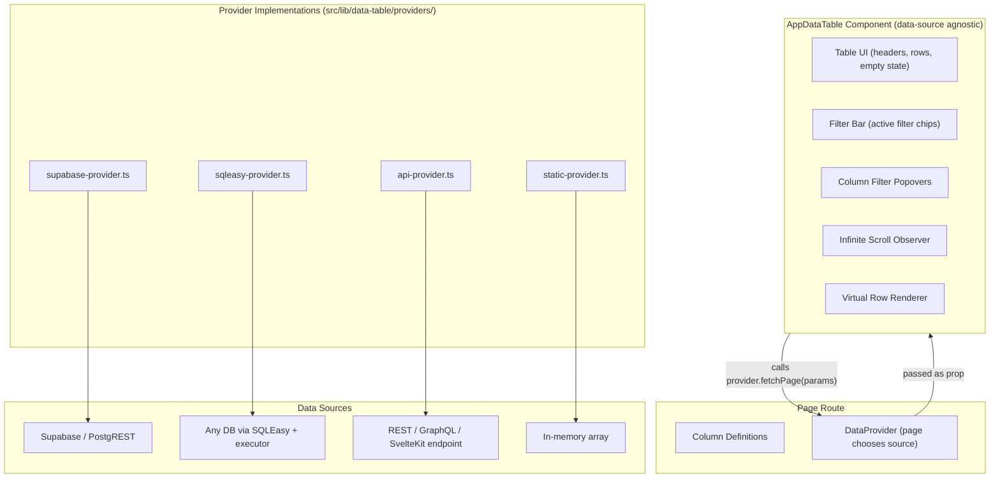

# Reusable Data Table with Infinite Scroll and Advanced Filtering

## Current State

The project already has:

- **`@tanstack/table-core`** (`^8.21.3`) with a Svelte 5 wrapper ([`src/lib/components/ui/data-table/data-table.svelte.ts`](src/lib/components/ui/data-table/data-table.svelte.ts)) providing `createSvelteTable`, `FlexRender`, `renderComponent`, `renderSnippet`
- **shadcn-svelte `table` primitives** ([`src/lib/components/ui/table/`](src/lib/components/ui/table/)) for styled `<table>` elements
- **`@deebeetech/sqleasy`** (`^1.0.2`) -- SQL builder supporting Postgres, MySQL, MSSQL, SQLite (installed but not yet imported)
- **Supabase client** using `deebee_edms` schema -- one data source but not the only one
- **No existing data table usage** in any route yet (workflows page uses a card grid)

## Architecture -- Data Provider Pattern

The critical design choice: the `AppDataTable` component is **completely data-source agnostic**. It never imports Supabase, SQLEasy, or any database client. Instead, each page passes in a `DataProvider` -- a simple async function that receives filter/sort/pagination params and returns rows + metadata. This means the same table component works against Supabase, a SQLEasy query hitting any DB, a REST API, or even a static array.



## The DataProvider Interface

The entire contract between the table and its data source is one function signature:

```typescript
type DataProvider<T> = (
  params: DataProviderParams,
) => Promise<DataProviderResult<T>>;

interface DataProviderParams {
  filters: ColumnFilter[];
  filterGroups?: FilterGroup[]; // for compound OR groups
  sort: SortSpec[];
  offset: number;
  limit: number;
}

interface DataProviderResult<T> {
  rows: T[];
  totalCount: number; // for "showing X of Y" display
  hasMore: boolean; // drives infinite scroll
}
```

Each provider implementation translates the generic `ColumnFilter` objects (which use a `FilterOperator` enum like `contains`, `regex`, `gt`, etc.) into whatever query mechanism the data source requires:

- **Supabase provider** -- maps to `.eq()`, `.ilike()`, `.filter('~', ...)`, `.range()`, etc.
- **Static provider** -- filters/sorts an in-memory array with JS (useful for small datasets, testing, or data already fully loaded)
- **SQLEasy provider** -- maps `FilterOperator` to `WhereOperator`, builds SQL via `@deebeetech/sqleasy` (`PostgresSqlEasy`, `MysqlSqlEasy`, etc.), then executes via a pluggable `QueryExecutor` (can be a SvelteKit API route fetch, an external service call, or a direct DB driver)
- **API provider** -- configurable REST/GraphQL/SvelteKit endpoint provider. Config object specifies URL pattern, headers, how to map filters/sort/pagination to request params (query string, JSON body, or GraphQL variables), and how to extract rows/count from the response

## Key Design Decisions

### Data-source agnostic core

- The `AppDataTable` component and all its sub-components (`filter-bar`, `column-filter-popover`, `filter-builder-dialog`, `virtual-rows`) have **zero imports** from Supabase, SQLEasy, or any DB client
- Filter operators are defined generically with labels and applicable types (text/number/date/boolean) -- provider implementations decide how to translate them
- This keeps the component reusable across any data source in the app

### Infinite scroll via provider callbacks

- Initial data can be passed as a prop (from SSR `load`) or fetched on mount
- As the user scrolls near the bottom, the component calls `provider({ ...currentParams, offset: loadedRows.length })` to fetch the next page
- The provider's `hasMore` flag tells the table when to stop

### Virtual scrolling for render performance

- Add `@tanstack/virtual-core` (same pattern as table-core -- Svelte 5 runes wrapper, no framework adapter)
- Only DOM-renders visible rows plus a small overscan buffer
- Combined with infinite scroll: virtual scroller triggers data fetch when the user scrolls near the end of loaded data

### Filter system design

- **Per-column filter popovers** on header click (like ag-grid) with a type dropdown + value input
- **Filter bar** above the table showing active filters as removable chips (`Name contains "test"`)
- **Filter types**: equals, not equals, contains, starts with, ends with, **regex**, greater than, less than, between, in list, is null, is not null
- **Compound mode**: filters across columns combine with AND; a "Filter Builder" dialog allows OR groups
- Filter types are defined in a **generic registry** -- not tied to any DB dialect

### URL state sync

- Filters, sort, and scroll position are serialized to URL search params
- Works with SvelteKit's `$page.url` and `goto()` for shareable/bookmarkable table states
- The `+page.server.ts` `load` function can read these params to provide SSR'd initial data

## New Dependency

- `@tanstack/virtual-core` -- headless virtual scroll core (MIT, free), same approach as the existing `@tanstack/table-core` usage

## File Structure

### Data table core -- [`src/lib/data-table/`](src/lib/data-table/)

- **`types.ts`** -- `DataProvider<T>`, `DataProviderParams`, `DataProviderResult<T>`, `FilterOperator` enum, `ColumnFilter`, `FilterGroup`, `SortSpec`, `ColumnMeta` (column type hints for filter UI)
- **`filter-operators.ts`** -- Registry of filter operators: `{ key, label, applicableTypes, valueCount }`. Purely descriptive -- no DB logic here. Example: `{ key: 'regex', label: 'Matches regex', applicableTypes: ['text'], valueCount: 1 }`
- **`url-state.ts`** -- `serializeTableState()` / `deserializeTableState()`: encode filters, sort, and offset into URL search params

### Provider implementations -- [`src/lib/data-table/providers/`](src/lib/data-table/providers/)

- **`supabase-provider.ts`** -- `createSupabaseProvider<T>(config)`: factory returning a `DataProvider<T>`. Config specifies table name, select columns, default sort. Maps `FilterOperator` to PostgREST methods (`.eq()`, `.ilike()`, `.filter('col', '~', 'regex')`, `.range()`, etc.). Tested via the workflows page POC.

- **`static-provider.ts`** -- `createStaticProvider<T>(data, config?)`: wraps a `T[]` array. Applies filters/sort/pagination in JS. Good for small datasets, testing, or data already fully loaded from any source.

- **`sqleasy-provider.ts`** -- `createSqlEasyProvider<T>(config)`: builds SQL using `@deebeetech/sqleasy`. Config includes:
  - `dialect`: which SQLEasy class to use (`PostgresSqlEasy`, `MysqlSqlEasy`, `MssqlSqlEasy`, `SqliteSqlEasy`)
  - `table`, `columns`, `schema` (optional)
  - `executor: QueryExecutor` -- a pluggable async function `(sql: string, params: unknown[]) => Promise<{ rows: T[]; totalCount: number }>` that actually runs the query. This decouples SQL building from execution, so the same provider works whether execution goes through:
    - A SvelteKit `+server.ts` endpoint (provider does a `fetch('/api/query', { body: { sql, params } })`)
    - A direct DB driver call (e.g., `pg` pool in a server-only context)
    - An external service that accepts SQL
  - Internally maps `FilterOperator` to `WhereOperator` enums, uses `.where()`, `.whereBetween()`, `.whereInValues()`, `.whereNotNull()`, `.limit()`, `.offset()`, `.orderByColumn()`, and wraps with a count CTE for `totalCount`.

- **`api-provider.ts`** -- `createApiProvider<T>(config)`: flexible provider for any HTTP-based data source. Config includes:
  - `endpoint`: URL string or `(params) => string` function for dynamic URLs
  - `method`: `'GET'` | `'POST'` (default `'GET'`)
  - `headers`: static headers or `() => Headers` factory (for auth tokens)
  - `mapParams`: `(params: DataProviderParams) => Record<string, string> | object` -- transforms generic filter/sort/pagination into whatever the API expects (query string params for REST, JSON body for POST, GraphQL variables)
  - `mapResponse`: `(response: unknown) => DataProviderResult<T>` -- extracts `rows`, `totalCount`, `hasMore` from the API's response shape
  - Ships with helper presets: `restPreset()` (standard `?filter[col]=val&sort=col&offset=N&limit=N`), `graphqlPreset(query)` (wraps in a GraphQL query with variables), `sveltekitPreset(routePath)` (fetches from an internal `+server.ts` endpoint with JSON body)

### Data table components -- [`src/lib/components/data-table/`](src/lib/components/data-table/)

- **`app-data-table.svelte`** -- Main reusable component. Props: `provider: DataProvider<T>`, `columnDefs`, `initialData?`, optional snippets for row actions, empty state, etc. Manages TanStack table instance, virtual scroller, data fetching state, infinite scroll trigger.
- **`column-filter-popover.svelte`** -- Popover on each filterable column header. Shows operator dropdown (filtered by column type) + value input. Apply/Clear buttons.
- **`filter-bar.svelte`** -- Horizontal bar of active filter chips. Each chip: `column operator value` with a remove button. "Clear All" at the end.
- **`filter-builder-dialog.svelte`** -- Dialog for compound filter building. Rows of `(column, operator, value)` with AND/OR group toggles.
- **`virtual-rows.svelte`** -- Wraps `@tanstack/virtual-core` Virtualizer; renders only visible `<tr>` elements with spacer rows.

### Svelte 5 virtual scroll wrapper -- [`src/lib/components/ui/data-table/virtualizer.svelte.ts`](src/lib/components/ui/data-table/virtualizer.svelte.ts)

- Thin reactive wrapper around `@tanstack/virtual-core` `Virtualizer`, following the same runes-based pattern as the existing `createSvelteTable`

## Usage Pattern (Example: Workflows List)

**`+page.server.ts`** -- provides SSR initial data:

```typescript
import { deserializeTableState } from "$lib/data-table/url-state";
import { createSupabaseProvider } from "$lib/data-table/providers/supabase-provider";

const provider = createSupabaseProvider<WorkflowRow>({
  table: "workflows",
  columns: "id, name, description, version, is_active, updated_at",
  defaultSort: [{ column: "updated_at", ascending: false }],
});

export const load: PageServerLoad = async ({ url }) => {
  const tableState = deserializeTableState(url.searchParams);
  const initialData = await provider({ ...tableState, offset: 0, limit: 50 });
  return { initialData };
};
```

**`+page.svelte`** -- passes provider + initial data:

```svelte
<script lang="ts">
  import { AppDataTable } from "$lib/components/data-table";
  import { createSupabaseProvider } from "$lib/data-table/providers/supabase-provider";

  let { data } = $props();

  const provider = createSupabaseProvider<WorkflowRow>({
    table: "workflows",
    columns: "id, name, description, version, is_active, updated_at",
    defaultSort: [{ column: "updated_at", ascending: false }],
  });
</script>

<AppDataTable {provider} columnDefs={workflowColumns} initialData={data.initialData}>
  {#snippet actions(row)}
    <Button href="/app/workflows/{row.id}">Edit</Button>
  {/snippet}
</AppDataTable>
```

To use a different data source, the page just passes a different provider:

```svelte
<!-- SQLEasy against a Postgres DB via a SvelteKit API route -->
<script lang="ts">
  import { createSqlEasyProvider } from "$lib/data-table/providers/sqleasy-provider";
  import { PostgresSqlEasy } from "@deebeetech/sqleasy";

  const provider = createSqlEasyProvider<AuditRow>({
    dialect: PostgresSqlEasy,
    table: "audit_logs",
    columns: ["id", "action", "user", "timestamp"],
    executor: async (sql, params) => {
      const res = await fetch("/api/query", {
        method: "POST",
        body: JSON.stringify({ sql, params }),
      });
      return res.json();
    },
  });
</script>

<AppDataTable {provider} columnDefs={auditColumns} />
```

```svelte
<!-- REST API with custom param mapping -->
<script lang="ts">
  import { createApiProvider, restPreset } from "$lib/data-table/providers/api-provider";

  const provider = createApiProvider<Product>({
    ...restPreset("/api/v1/products"),
    headers: () => ({ Authorization: `Bearer ${token}` }),
  });
</script>

<AppDataTable {provider} columnDefs={productColumns} />
```

```svelte
<!-- Static in-memory data -->
<AppDataTable provider={createStaticProvider(myArray)} columnDefs={columns} />
```

## Demo Page -- [`src/routes/(no-layout)/test-data-table/`](<src/routes/(no-layout)/test-data-table/>)

Following the existing pattern of `test-form`, `test-builder`, `test-multistep`, and `test-workflow`, a standalone demo page at `/test-data-table` will showcase the data table with all its features.

**Files:**

- **`sample-data.ts`** -- generates a random dataset (~500 rows) of fake "employee" records with mixed column types: `id` (number), `name` (text), `email` (text), `department` (text, limited set), `salary` (number), `hireDate` (date string), `isActive` (boolean), `notes` (text, some null). Gives a realistic spread of data types for exercising every filter operator.
- **`+page.svelte`** -- the demo page itself, with tabs or sections showing:
  - **Static provider tab** -- the full 500-row dataset loaded via `createStaticProvider`, demonstrating client-side filtering, sorting, virtual scrolling, and infinite scroll through in-memory data
  - **API provider tab** -- wired to a local `+server.ts` endpoint, demonstrating the API provider with REST-style param mapping
  - **SQLEasy provider tab** -- wired to a local `+server.ts` endpoint that uses `PostgresSqlEasy` to build and log the generated SQL (even if not connected to a real DB, shows the SQL that would run)
  - Each tab exercises: column filters, stacked filter chips, the filter builder dialog, column sorting, and infinite scroll
- **`+server.ts`** -- a local API endpoint that the API and SQLEasy provider tabs call. Accepts filter/sort/pagination params, applies them to the sample data in-memory (simulating a real backend), and returns JSON results. For the SQLEasy tab, also returns the generated SQL string for display.

## Scope and Testing

All four providers (Supabase, Static, SQLEasy, API) will be fully implemented and structurally complete. The Supabase provider will be tested end-to-end through the workflows listing page POC. The SQLEasy and API providers need to compile and be structurally sound -- they will be validated when their respective data sources are wired up in the app. The workflows listing page will be converted from its current card grid to use `AppDataTable` as the proof-of-concept.
