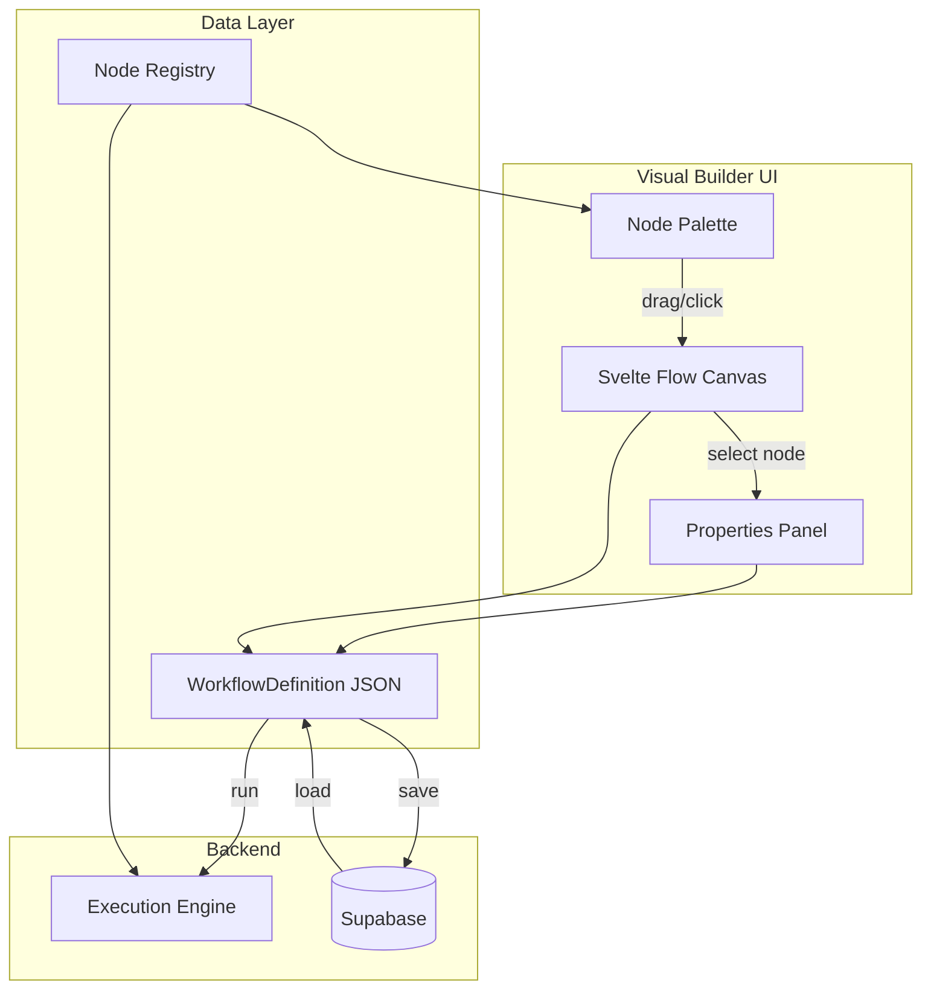

# Workflow Builder and Execution Engine

## Architecture Overview

The system has three major layers: **definition types + registry**, **visual builder UI**, and **server-side execution engine**, all persisted to Supabase.



---

## 1. Data Model (`src/lib/workflows/types.ts`)

Mirrors the pattern from [`src/lib/forms/types.ts`](src/lib/forms/types.ts).

```typescript
type NodeType =
  | "manual-trigger"
  | "webhook-trigger"
  | "api-call"
  | "condition"
  | "transform"
  | "delay"
  | "email"
  | "loop"
  | "supabase-query"
  | "custom-script";

interface WorkflowDefinition {
  id: string;
  name: string;
  description?: string;
  version: number;
  globalState: GlobalVariable[];
  nodes: WorkflowNodeDefinition[];
  edges: WorkflowEdgeDefinition[];
  viewport?: { x: number; y: number; zoom: number };
}

interface GlobalVariable {
  key: string;
  type: "string" | "number" | "boolean" | "object" | "array";
  defaultValue?: unknown;
  description?: string;
}

interface WorkflowNodeDefinition {
  id: string;
  type: NodeType;
  label: string;
  position: { x: number; y: number };
  config: Record<string, unknown>;
}

interface WorkflowEdgeDefinition {
  id: string;
  source: string;
  target: string;
  sourceHandle: "success" | "failure";
  label?: string;
}
```

Each node type has a typed config interface (e.g., `ApiCallConfig` has `method`, `url`, `headers`, `body`; `ConditionConfig` has `expression`, `field`, `operator`, `value`).

---

## 2. Node Registry (`src/lib/workflows/node-registry.ts`)

Mirrors [`src/lib/forms/field-registry.ts`](src/lib/forms/field-registry.ts). Maps each `NodeType` to metadata and default config.

```typescript
interface NodeRegistryEntry {
  label: string;
  icon: Component;
  category: NodeCategory; // 'trigger' | 'action' | 'logic' | 'integration'
  description: string;
  color: string; // tailwind color token for node header
  defaultConfig: Record<string, unknown>;
  configSchema: ConfigField[]; // drives the properties panel
  hasFailureOutput: boolean; // some nodes (triggers) may not need failure
}
```

`configSchema` is an array of `ConfigField` objects describing each property the node exposes in the right panel -- name, type (text, select, json, expression, etc.), label, placeholder, etc. This keeps node config UI fully data-driven rather than requiring a custom config component per node type.

**Initial categories and nodes:**

- **Triggers**: Manual Trigger, Webhook Trigger
- **Actions**: API Call, Send Email, Delay
- **Logic**: Condition/Branch, Loop/For-Each, Transform/Map
- **Integrations**: Supabase Query, Custom Script

---

## 3. Component Architecture

```
src/lib/
  workflows/
    types.ts
    node-registry.ts
    engine.ts
    engine-handlers.ts
    validation.ts
  components/
    workflow-builder/
      workflow-builder.svelte      # 3-column shell
      node-palette.svelte          # left panel
      workflow-canvas.svelte       # @xyflow/svelte wrapper
      node-config.svelte           # right panel: dynamic config form
      global-state-editor.svelte   # right panel tab: workflow state schema
      custom-nodes/
        workflow-node.svelte       # single custom node (handles all types via registry)
      custom-edges/
        workflow-edge.svelte       # colored success/failure edge
      index.ts
```

### 3a. Builder Shell (`workflow-builder.svelte`)

Three-column flex layout identical to [`form-builder.svelte`](src/lib/components/form-builder/form-builder.svelte):

- **Left (~w-56)**: Node Palette grouped by category
- **Center (flex-1)**: Svelte Flow canvas with toolbar (workflow name, controls)
- **Right (~w-72)**: Properties panel with two modes: "Node Config" (when a node is selected) and "Global State" (toggle/tab)

Props: `definition: WorkflowDefinition`, `ondefinitionchange?: (def) => void` -- same controlled pattern as the form builder.

### 3b. Canvas (`workflow-canvas.svelte`)

Wraps `@xyflow/svelte` with:

- Custom node type registered via `nodeTypes` prop (one `WorkflowNode` component handles all types using registry data for icon/color/label)
- Custom edge type with color coding (green for success handle, red for failure handle)
- Background grid, MiniMap, Controls plugins
- Drop handler: listens for drops from the palette, creates a new node at drop position
- `onnodeschange` / `onedgeschange` / `onconnect` callbacks that sync back to the definition

### 3c. Custom Node (`workflow-node.svelte`)

A single reusable Svelte component that renders all node types. Looks up the registry entry for the node's type to get icon, color, label. Renders:

- Colored header bar (by category/type)
- Icon + label
- **Top handle**: input (target)
- **Bottom-left handle**: success output (source, green dot)
- **Bottom-right handle**: failure output (source, red dot)

Trigger nodes only have output handles (no input).

### 3d. Custom Edge (`workflow-edge.svelte`)

Extends the default bezier edge. Green stroke when connected to a `success` handle, red when connected to a `failure` handle. Optional label on the edge.

### 3e. Node Config (`node-config.svelte`)

Reads `configSchema` from the registry for the selected node's type, renders a dynamic form (text inputs, selects, JSON editors, expression fields). Supports `{{state.variableName}}` template syntax in string fields for referencing global state.

### 3f. Global State Editor (`global-state-editor.svelte`)

A panel to add/remove/edit global variables (key, type, default value, description). Accessible via a tab or button in the right panel header.

---

## 4. Node Addition Flow

Two methods (same as form builder approach):

1. **Click**: Click a node type in the palette, it appears at a default/center position on the canvas
2. **Drag**: Drag from palette onto canvas, drops at cursor position

Svelte Flow has built-in support for the drop pattern using the `onconnect`, `onDrop`, `onDragOver` events on the `SvelteFlow` component.

---

## 5. Supabase Persistence

### Migration: new tables in `deebee_edms` schema

- **`workflows`**: `id uuid PK`, `org_id text`, `name text`, `description text`, `definition jsonb`, `version int`, `is_active boolean`, `created_at timestamptz`, `updated_at timestamptz`
- **`workflow_runs`**: `id uuid PK`, `workflow_id uuid FK`, `status text` (pending/running/completed/failed), `global_state jsonb`, `started_at timestamptz`, `completed_at timestamptz`, `error text`
- **`workflow_run_steps`**: `id uuid PK`, `run_id uuid FK`, `node_id text`, `node_type text`, `status text`, `input jsonb`, `output jsonb`, `started_at timestamptz`, `completed_at timestamptz`, `error text`

RLS policies scoped to org_id via Clerk.

### Routes

- `(app-layout)/app/workflows/+page.svelte` -- list/manage workflows
- `(app-layout)/app/workflows/[id]/+page.svelte` -- builder/editor for a workflow
- `(no-layout)/test-workflow/+page.svelte` -- standalone test page (like test-builder)
- API route `api/workflows/[id]/run/+server.ts` -- trigger workflow execution

---

## 6. Execution Engine (`src/lib/workflows/engine.ts`)

A server-side async runner:

```typescript
async function executeWorkflow(
  definition: WorkflowDefinition,
  initialState?: Record<string, unknown>,
): Promise<WorkflowRunResult>;
```

**Algorithm:**

1. Find the trigger node (entry point)
2. Initialize global state from definition defaults + any overrides
3. Execute nodes sequentially following edges:
   - Call the handler for the node's type (from `engine-handlers.ts`)
   - Handler receives `{ config, globalState, input }` and returns `{ output, stateUpdates }`
   - Merge `stateUpdates` into global state
   - On success: follow the `success` edge to next node
   - On error/failure: follow the `failure` edge (if exists), otherwise mark run as failed
4. Log each step to `workflow_run_steps`
5. Special handling:
   - **Condition**: evaluates expression, follows success (true) or failure (false)
   - **Loop**: iterates over an array in state, executes downstream subgraph per item
   - **Delay**: `await new Promise(resolve => setTimeout(resolve, ms))`

Each handler in `engine-handlers.ts` is a simple async function. The `api-call` handler uses `fetch()`. The `supabase-query` handler uses the Supabase client. The `custom-script` handler could use a sandboxed `Function()` or similar.

---

## 7. State Reference Syntax

Node config values can reference global state using `{{state.variableName}}` mustache-style templates. Before a node executes, the engine resolves these references from the current global state. The properties panel could show autocomplete for available state variables.

---

## 8. Dependencies to Add

- `@xyflow/svelte` (^1.5.2) -- the canvas library

No other new dependencies needed; the existing stack (shadcn-svelte, Lucide, Svelte 5 runes, Supabase, valibot) covers everything else.

---

## 9. Phased Implementation Order

Given the scope, implementation should follow this sequence:

1. **Types + Registry** -- data model foundation
2. **Builder UI** -- canvas, palette, properties (using @xyflow/svelte)
3. **Test page** -- standalone test-workflow route with JSON preview (like test-builder)
4. **Supabase migration + persistence** -- save/load workflows
5. **Execution engine + handlers** -- server-side runner
6. **App routes** -- workflow list + editor pages in the main app layout
